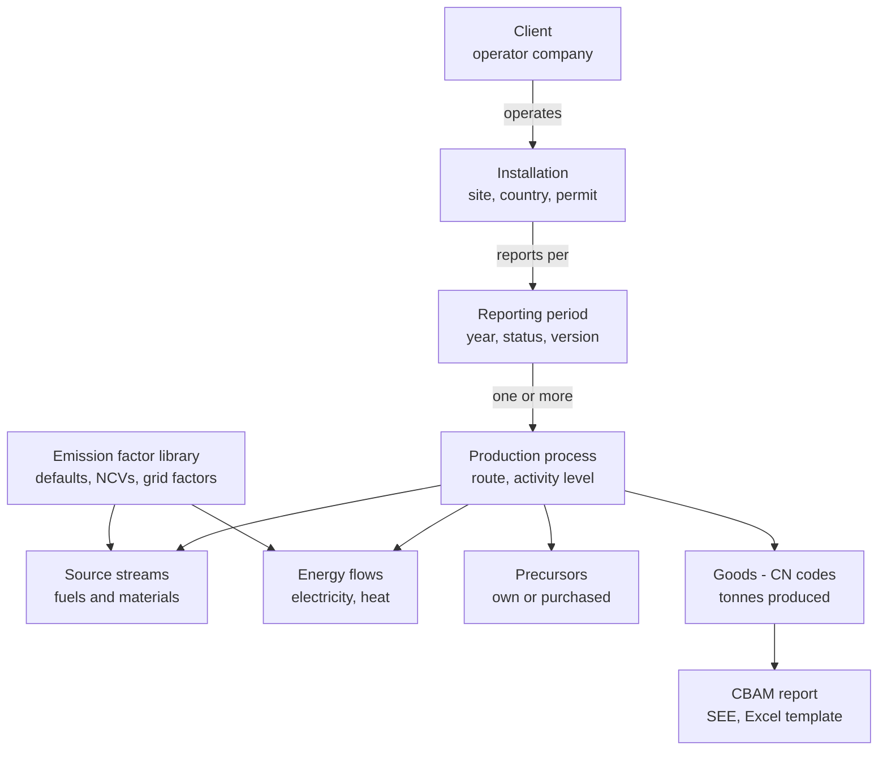

# CBAM Reporting Web Application — Modular Build Plan

Exported 29 Sep 2026 from the living plan document. Update this file when the plan changes.
Updated 29 Sep 2026 with Phase 1 decisions D2 and D3 (`docs/plans/phase-1.md`) after checking template 2026-Q2 sheet A.

## 1. Purpose and scope

The application lets a consultant onboard many clients (operators of installations outside the EU), capture their production and emissions data, calculate specific embedded emissions (SEE) per good, and export the EU CBAM Communication Template for Installations plus a verification-ready report.

**Regulatory basis.** CBAM is set by Regulation (EU) 2023/956. The transitional period (quarterly reports by importers) ran Oct 2023 to Dec 2025; the definitive period started 1 Jan 2026, with annual declarations by authorised CBAM declarants and verified embedded emissions. Covered sectors: cement, iron and steel, aluminium, fertilisers, hydrogen and electricity.

These regulatory points are from general knowledge and were not re-checked against the latest implementing acts and the 2025 simplification package. Confirm them before the calculation rules are frozen.

| In scope | Out of scope (phase 1) |
| --- | --- |
| Multi-client, multi-installation data capture | Filing on the EU CBAM Registry on the importer's behalf |
| Direct, indirect and precursor emissions per good | Purchase or surrender of CBAM certificates |
| SEE calculation per production process and CN code | Electricity as an imported good |
| Carbon price paid in the country of origin | Customs declarations |
| Export to the official EU Excel template, PDF report | Full verifier workflow (read-only verifier access only) |
| Evidence storage and audit trail | |

## 2. User roles

| Role | Who | Can do |
| --- | --- | --- |
| Platform admin | CETIZION | Manage tenants, users, emission factor library, template versions |
| Consultant (lead) | CETIZION consultant | Create clients and installations, configure processes, review data, run calculations, issue reports |
| Data contributor | Client plant or ESG staff | Enter activity data, upload evidence, answer review queries for assigned installations |
| Reviewer / verifier | Internal QA or external verifier | Read all data and calculations, raise findings, sign off a reporting period |
| Report recipient | Client management or the EU importer | View and download the approved report and Excel template |

## 3. Entities and data model

The production process is the calculation unit: every emission, energy flow and precursor attaches to a process in one reporting period, and SEE is then assigned to the goods it makes.

| Entity | What it holds | Linked to |
| --- | --- | --- |
| Tenant | Service provider account (CETIZION), branding, settings | Users, clients |
| User | Name, email, role, assigned clients and installations | Tenant, audit log |
| Client | Operator company: legal name, registration no., address, contact | Installations, EU importers |
| EU importer (customer) | Importer or indirect customs representative receiving the data, EORI | Client, reports |
| Installation | Site name (local and English), address, country, UN/LOCODE, coordinates, permit, monitoring plan | Client, reporting periods |
| Reporting period | Start and end date, justification for a non-calendar year | Installation, period versions |
| Period version | Version number, status, lock, pinned factor-library and template versions | Reporting period, processes, reports |
| Production process | Aggregated goods category, production route, activity level | Period, source streams, energy, precursors, goods |
| Good | CN code (8-digit), quantity, qualifying parameters | Process, report |
| Source stream | Fuel or material with activity data and factors (calculation method) | Process, emission factor library |
| Emission source | Stack or point measured by CEMS (measurement method) | Process |
| Energy flow | Electricity, measurable heat, waste gases, imported or exported | Process, emission factor library |
| Precursor link | Precursor good consumed by a process, own or purchased | Consuming process, producing process or supplier |
| Supplier installation | Third-party producer of a purchased precursor and its SEE | Precursor link |
| Emission factor library | Default values, NCVs, emission factors, grid factors, GWPs, versioned | Source streams, energy flows, precursors |
| Carbon price paid | Country, instrument, price, rebates, covered emissions | Period, goods |
| Evidence document | File, type, date, uploaded by, linked record | Any data record |
| Review finding | Comment, severity, status, resolved by | Any data record, period |
| Report version | Generated outputs, template version, approval, hash | Period, importer |
| Audit log | Who changed what, old and new value, time | All records |

## 4. Parameters to track

About 70 parameters in ten groups feed the SEE calculation and the template; groups 4.3 to 4.8 drive the numbers, the rest drive identification, quality and traceability. Every numeric parameter also stores its unit, data source, and whether it is measured, estimated or a default.

### 4.1 Client and installation

| Parameter | Unit / format | Notes |
| --- | --- | --- |
| Operator legal name, address, country | Text | Not in the template; used in the PDF report and importer summary |
| Operator contact person, email, phone | Text | |
| Installation name (local, optional) and English name | Text | Template sheet A; one client can have many |
| Installation address: street and number, P.O. box, post code, city | Text | Template sheet A |
| Country of installation | ISO 3166 code | Drives grid factor and carbon price rules |
| UN/LOCODE | Code | Template field |
| Latitude, longitude | Decimal degrees | Coordinates of the main emission source (template sheet A) |
| Installation ID / permit number | Text | Local registry ID if one exists |
| Main economic activity | Text / code | |
| Authorised representative: name, email, telephone | Text | Template sheet A |
| EU importer(s) served, EORI | Text | Who receives the data; not in the template |

### 4.2 Reporting period

| Parameter | Unit / format | Notes |
| --- | --- | --- |
| Period start and end | Date | Calendar year by default; other 12-month periods allowed with justification |
| Period status | Draft / In review / Approved / Issued | Held per data version; locks data on approval |
| Monitoring methodology | Calculation / measurement / mass balance | Per source stream or source |
| Data version | Integer | New version on any change after issue; each version pins its factor-library and template version |

### 4.3 Production processes and goods

| Parameter | Unit / format | Notes |
| --- | --- | --- |
| Aggregated goods category | List (e.g. crude steel, unwrought aluminium, clinker, ammonia) | Defines system boundary |
| Production route | List per category (e.g. BF-BOF, EAF, primary smelting) | |
| CN codes produced | 8-digit | One process can make several |
| Activity level (total production) | t | Denominator of SEE |
| Quantity per CN code | t | Share of the activity level |
| Quantity sold to EU vs other markets | t | For the importer summary |
| Quantity consumed as precursor internally | t | Avoids double counting |
| Qualifying parameters | Varies by sector | E.g. clinker content of cement, N content and form of fertilisers, alloy content of steel, scrap share of aluminium, hydrogen purity |

### 4.4 Direct emissions: calculation-based (per source stream)

| Parameter | Unit | Notes |
| --- | --- | --- |
| Source stream name and type | Combustion / process / mass balance | |
| Activity data | t, Nm³ or TJ | Consumed or produced quantity |
| Net calorific value (NCV) | GJ/t or GJ/Nm³ | Combustion only |
| Emission factor | tCO₂/TJ or tCO₂/t | |
| Oxidation factor | Fraction | Combustion |
| Conversion factor | Fraction | Process emissions |
| Carbon content | tC/t | Mass balance; inputs positive, outputs negative |
| Biomass fraction | Fraction | Biomass CO₂ excluded |
| Tier or data source | List | Default, lab analysis, supplier data |
| Allocation to processes | % per process | When one stream serves several processes |

### 4.5 Direct emissions: measurement-based and non-CO₂

| Parameter | Unit | Notes |
| --- | --- | --- |
| GHG concentration (hourly average) | mg/Nm³ or % | CEMS per emission source |
| Flue gas flow | Nm³/h | |
| Operating hours | h | |
| Corroborating calculation | tCO₂ | Cross-check against calculation method |
| N₂O emissions | t N₂O | Nitric and adipic acid (fertilisers) |
| PFC data (CF₄, C₂F₆) | Anode effect minutes per cell-day, slope coefficient, or overvoltage | Primary aluminium |
| GWP values | tCO₂e/t | From the factor library |

### 4.6 Energy flows

| Parameter | Unit | Notes |
| --- | --- | --- |
| Electricity consumed per process | MWh | Drives indirect emissions |
| Electricity source | Grid / PPA / own generation | |
| Electricity emission factor and its basis | tCO₂/MWh | Grid default, PPA or own-plant factor, with evidence |
| Electricity exported | MWh | Deducted from attributed emissions where applicable |
| Measurable heat imported / exported | TJ | With heat emission factor (tCO₂/TJ) |
| Heat from non-measurable sources | TJ | |
| Waste gases imported / exported | TJ, NCV | With emission factor |

### 4.7 Precursors

| Parameter | Unit | Notes |
| --- | --- | --- |
| Precursor good and CN code | List | Must be a relevant precursor for the route |
| Origin | Own process / purchased | Own: link to producing process |
| Quantity consumed per process | t | |
| Supplier installation and country | Text | Purchased only |
| Precursor SEE, direct and indirect | tCO₂e/t | From supplier's communication or default |
| Default value used | Yes / no | Flags data quality |

### 4.8 Carbon price paid

| Parameter | Unit | Notes |
| --- | --- | --- |
| Country and instrument | Carbon tax / ETS | |
| Price effectively paid | Local currency per tCO₂e | |
| Rebates, free allocation, compensation | Amount | Reduces the effective price |
| Emissions covered | tCO₂e | And the goods they relate to |
| Exchange rate and date | Rate | For EUR conversion |
| Legal act reference and evidence | Text, file | |

### 4.9 Data quality and defaults

| Parameter | Unit | Notes |
| --- | --- | --- |
| Default value flag and reason | Yes / no, text | Per value |
| Share of emissions from default values | % | Summary indicator |
| Estimation method for data gaps | Text | |
| Uncertainty or tier achieved | Text | |

### 4.10 Evidence and verification

| Parameter | Unit | Notes |
| --- | --- | --- |
| Supporting documents | File + type + link to record | Invoices, meter readings, lab reports |
| Verifier name, address, contact and accreditation | Text | Template sheet A section 3: accreditation member state, body, registration number |
| Site visit date | Date | |
| Verification opinion and findings | Text, list | |
| Approval by consultant and client | User + timestamp | |

## 5. Calculation engine

The engine runs four steps per process and period: source-stream emissions, attributed process emissions, precursor roll-up, then SEE per tonne. It is a pure, versioned function set, so a report can always be recomputed exactly.

**Step 1 — source-stream emissions**

- Combustion: `Em_comb = AD × NCV × EF × OF × (1 − BF)`
- Process: `Em_proc = AD × EF × CF`
- Mass balance (outputs carry negative activity data): `Em_mb = 3.664 × Σ(AD_i × C_i)`
- Non-CO₂ gases: `Em = mass of gas × GWP`

**Step 2 — attributed direct emissions per process**

- `AttrEm_dir = DirEm + Em_H,imp − Em_H,exp + WG_imp − WG_exp − Em_el,exp`
- Indirect: `Em_indir = electricity consumed (MWh) × electricity emission factor (tCO₂/MWh)`

**Steps 3 and 4 — precursors and SEE**

- `SEE_dir = (AttrEm_dir + Σ_p M_p × SEE_dir,p) / AL`
- `SEE_ind = (Em_indir + Σ_p M_p × SEE_ind,p) / AL`

AL is the activity level (t) and M_p the tonnes of precursor p consumed. Total SEE = SEE_dir + SEE_ind for goods where indirect emissions count; for others only SEE_dir enters the declaration, while SEE_ind is still reported.

**Engine rules**

- Own-produced precursors are resolved first, in dependency order, so their SEE is available to downstream processes; circular links are blocked.
- Units are normalised on entry (GJ to TJ, kWh to MWh, kg to t) and stored in SI base plus the original entry.
- Every result stores the factor-library version and template version used.
- Plausibility checks flag SEE outside a sector benchmark band, mass balances that do not close, and processes with zero activity level.
- Test suite: reproduce the worked examples in the official EU template to the last decimal before go-live.

## 6. Application modules

Thirteen modules, each with its own API routes, tables and screens, so they can be built, tested and released independently. M5 to M10 are the calculation core; everything else supports it.

| # | Module | Purpose | Key screens | Depends on |
| --- | --- | --- | --- | --- |
| M1 | Tenant and access | Users, roles, client assignment, login | Users, roles, invitations | — |
| M2 | Client and installation registry | Onboard operators, installations, EU importers | Client list, installation profile | M1 |
| M3 | Reporting period manager | Open, lock, version and clone periods | Period dashboard, status bar | M2 |
| M4 | Reference library | Default values, NCVs, emission factors, grid factors, GWPs, CN-code list, versioned | Factor tables, import from EU files | — |
| M5 | Process and goods set-up | Define processes, routes, CN codes, qualifying parameters | Process builder | M3, M4 |
| M6 | Direct emissions | Source streams, CEMS sources, PFC and N₂O | Source-stream grid, per-method forms | M5 |
| M7 | Energy flows | Electricity, heat, waste gases | Energy balance sheet | M5 |
| M8 | Precursor chain | Own and purchased precursors, supplier SEE | Precursor map | M5 |
| M9 | Carbon price paid | Instruments, prices, rebates, FX | Carbon price form | M3 |
| M10 | Calculation engine | Steps 1–4 of section 5, dependency resolution | Results per process and per good | M4–M9 |
| M11 | Validation and review | Completeness checks, plausibility flags, review findings, sign-off | Issues list, review queue | M10 |
| M12 | Report generator | Official Excel template, PDF report, importer summary | Preview, download, version history | M10, M11 |
| M13 | Evidence and audit | File uploads linked to records, change log | Document library, audit trail | All |

A client dashboard (completion %, open issues, SEE per good, period-on-period change) sits on top of M3, M10 and M11.

## 7. User workflow

A report moves through nine steps, from onboarding to issue; steps 4 to 7 loop until the reviewer has no open findings.

1. **Onboard** — consultant creates the client, its installations and the EU importers it supplies (M2).
2. **Open period** — consultant opens a reporting period, or clones last period's set-up (M3).
3. **Configure** — consultant defines processes, routes, CN codes and the monitoring method per source stream (M5).
4. **Collect data** — client contributors enter activity data, energy, precursors and carbon price, or bulk-upload via an Excel import sheet, and attach evidence (M6–M9, M13).
5. **Calculate** — engine runs on every save and shows SEE per process and per good (M10).
6. **Validate** — completeness and plausibility checks raise issues; contributors fix or justify them (M11).
7. **Review** — consultant and optional verifier raise findings and sign off (M11).
8. **Generate** — approved period produces the Excel template, PDF report and importer summary (M12).
9. **Issue and lock** — outputs are shared with the importer; the period locks, and later changes create a new version.

## 8. Outputs

The primary output is the official EU Communication Template filled cell for cell, because that is what importers upload and verifiers expect; the other outputs are derived from the same locked dataset.

| Output | Format | Audience | Content |
| --- | --- | --- | --- |
| EU CBAM Communication Template for Installations | .xlsx (official template, current version) | EU importer, verifier | Installation data, emissions and energy, processes, purchased precursors, summaries per process, product and communication |
| CBAM emissions report | PDF | Client management, verifier | Methodology, system boundaries, results per good, data quality, default-value share, evidence index |
| Importer summary | PDF / .xlsx | Each EU importer | SEE direct and indirect per CN code, carbon price paid, period, contact |
| Calculation workbook | .xlsx | Verifier, consultant | Every input, factor, formula step and result, traceable to records |
| Data export | JSON / CSV | Integrations | Full period dataset for other systems |

Each generated file carries the report version, template version, factor-library version and a file hash, so the issued numbers can be matched to the stored data.

## 9. Technical architecture, validation and security

The stack is React front end, Node.js/Express API and PostgreSQL, with the calculation engine as an isolated, test-covered package the API calls.

| Layer | Choice | Notes |
| --- | --- | --- |
| Front end | React, TypeScript, a component library, spreadsheet-style grids for bulk entry | Forms mirror template sheets so consultants recognise them |
| API | Node.js, Express, REST, request validation with a schema library | One router per module |
| Calculation engine | Pure TypeScript package, decimal arithmetic (no floating point) | Unit-tested against the EU template examples |
| Database | PostgreSQL, one schema, client_id on every row, row-level security | Tenant and client isolation |
| Files | Cloudinary (private raw files, signed expiring links; phase 1 decision D13) | Evidence and generated reports |
| Report generation | ExcelJS writing into the official template; headless-browser PDF | Template versions stored in M4 |
| Jobs | Queue for report generation and bulk imports | Keeps the API responsive |

**Validation rules**

- Required-field completeness per method (e.g. combustion needs AD, NCV, EF, OF).
- Ranges: fractions between 0 and 1, non-negative quantities, NCV and EF within library bands.
- Balances: CN-code quantities sum to the activity level; heat and electricity exports do not exceed generation.
- Precursor links resolve to an existing process or supplier record.
- A period cannot be approved with open critical issues.

**Security and audit**

- Role-based access by client and installation; contributors see only assigned sites.
- Every create, update and delete is written to the audit log with old and new values.
- Approved periods are read-only; edits open a new version.
- Encryption in transit and at rest, daily backups, two-factor login for consultants and admins.

## 10. Phased delivery

Four phases, each ending in a gate; no dates are set yet.

1. **Foundation** — M1, M2, M3, M4 and M13 (access, registry, periods, reference library, evidence).
   - Gate: a client with two installations and one open period can be set up end to end.
2. **Calculation core** — M5 to M10 for one sector first (suggest aluminium, given CETIZION's ASI work), then the others.
   - Gate: engine matches the official EU template results on its examples and one real client dataset.
3. **Review and outputs** — M11 and M12: validation, sign-off, Excel template, PDF report, importer summary.
   - Gate: a consultant produces an issued report without editing the Excel by hand.
4. **Scale-up** — all sectors, bulk Excel import, dashboard, verifier access, API export.
   - Gate: three live clients reported in one cycle.

## 11. Open questions

- [ ] Which template version is the baseline, and how are new EU template releases adopted mid-cycle?
- [ ] Which sectors go first after the pilot sector?
- [ ] Will clients enter data themselves, or will consultants enter it from client files?
- [ ] Does the platform need to receive supplier SEE for purchased precursors directly from other installations?
- [ ] Are external verifiers given logins, or do they receive exported workbooks only?
- [ ] Which default values and grid factors are licensed for use, and who updates the library?
- [ ] Should the tool also support the importer's side (aggregating many suppliers into one declaration)?
- [ ] Confirm the regulatory points in section 1 against the latest implementing acts before freezing calculation rules.
